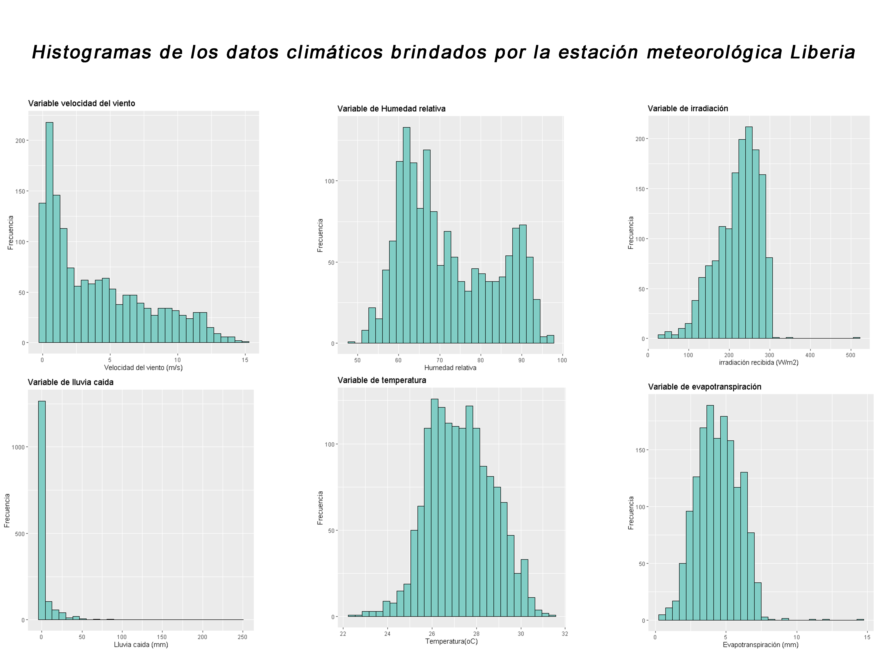
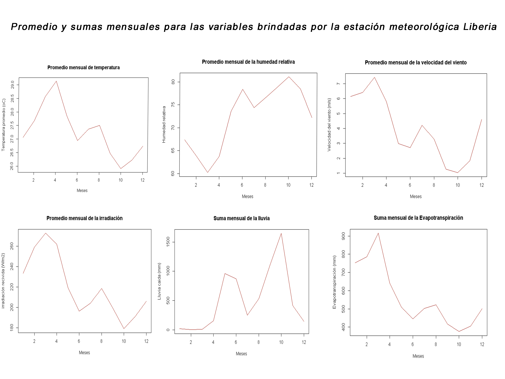
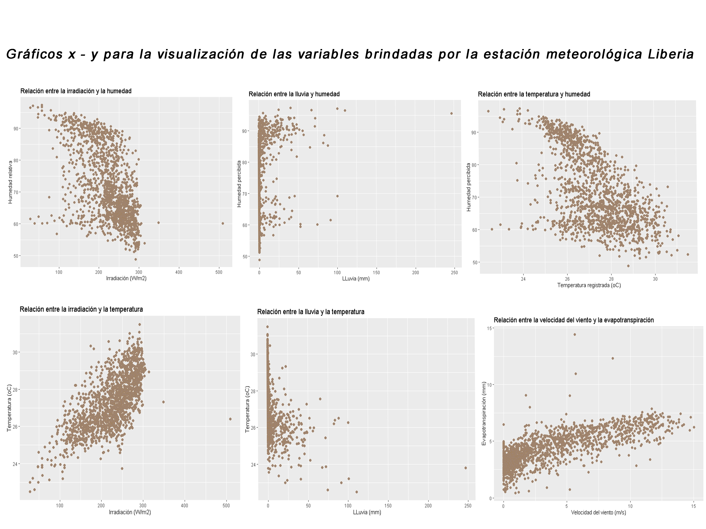

```{r setup, include=FALSE}
knitr::opts_chunk$set(echo = TRUE)
```

## R Markdown  

El siguiente proyecto está compuesto de la siguiente manera, donde la primera parte consta de una limpieza de los datos brindados por la estación meteorológica de Liberia donde se eliminaron los archivos con valores nulos (na’s) y se creó un nuevo documento sin estos datos para siguiente caracterizar el tipo de saparacion decimal de los datos y el formato de fecha. Durante la segunda parte, se grafican histogramas para representar las seis variables que brindó la estación meteorológica de Liberia. La sección numero tres cuenta con un promedio mensual para cuatro de las seis variables de modo que las dos que queden excluidas, se les graficó conforme a la suma mensual de sus respectivos valores. Y por ultimo, se realizaron graficos x y para analizar como estas variables están conectadas mediante una visualización de datos en forma de nube de puntos con el fin de un análisis visual de los factores. Para finalizar, se utilizó una herramienta fuera de r studio con el fin de una representación grafica mas accesible, el proceso de como y porqué se hizo usó esta herramienta está descrito en su respectivo apartado.  

```{r}
#Carga de las librerias
library(dplyr)
library(ggplot2)
library(hrbrthemes)
library(tidyverse)
library(gridExtra)

#Primera parte, limpieza de datos
DatosL <- read.csv("Liberia_datos climaticos.csv",sep = ",", na.strings = "", dec = ",") # se generó un nuevo archivo con nombre DatosL
DatosL[!complete.cases(DatosL),] # se identificaron archivos con NA^s
nDatosL <- na.omit(DatosL) # se limpió la memoria de NA^s y se eliminarón 25 lineas de datos
nDatosL[!complete.cases(nDatosL),] # se confirma que ya no hay datos NA¨s
sapply(nDatosL, mode) # Para visualizar el tipo de datos

nDatosL$Date <- as.Date(nDatosL$Date, "%d/%m/%Y") #Transformacion de datos a fechas

## Segunda parte
# acontinuación, se representan los gráficos para 6 variables dadas por los datos de la estación climatica de Liberia
#Historigramas de las variables

#Para temperatura
ggplot(nDatosL,aes(x = nDatosL[,2])) +
  geom_histogram(colour = "black", fill = "#80CDC4") +
  xlab("Temperatura (oC)") +
  ylab("Frecuencia") +
  ggtitle("Variable de temperatura") +
  geom_density(alpha=.2, fill= "#FF6666")

#Para Humedad relativa
ggplot(nDatosL,aes(x = nDatosL[,3])) +
  geom_histogram(colour = "black", fill = "#80CDC4") +
  xlab("Humedad Relativa") +
  ylab("Frecuencia") +
  ggtitle("Variable de Humedad relativa") +
  geom_density(alpha=.2, fill= "#FF6666")

#Para velocidad del viento
ggplot(nDatosL,aes(x = nDatosL[,4])) +
  geom_histogram(colour = "black", fill = "#80CDC4") +
  xlab("Velocidad del viento (m/s)") +
  ylab("Frecuencia") +
  ggtitle("Variable velocidad del viento") +
  geom_density(alpha=.2, fill= "#FF6666")

#Para lluvia
ggplot(nDatosL,aes(x = nDatosL[,5])) +
  geom_histogram(colour = "black", fill = "#80CDC4") +
  xlab("Lluvia caida (mm)") +
  ylab("Frecuencia") +
  ggtitle("Variable de lluvia") +
  geom_density(alpha=.2, fill= "#FF6666")

#Para irradiación
ggplot(nDatosL,aes(x = nDatosL[,6])) +
  geom_histogram(colour = "black", fill = "#80CDC4") +
  xlab("Irradiación recivida (W/m2)") +
  ylab("Frecuencia") +
  ggtitle("Variable de irradiación") +
  geom_density(alpha=.2, fill= "#FF6666")

#Para evapotranspiración
ggplot(nDatosL,aes(x = nDatosL[,7])) +
  geom_histogram(colour = "black", fill = "#80CDC4") +
  xlab("Evapotranspiración (mm))") +
  ylab("Frecuencia") +
  ggtitle("Variable de Evapotranspiración") +
  geom_density(alpha=.2, fill= "#FF6666")

##Tercera parte
#Promedios mensuales

#Promedio mensual serie de temperatura
PMtemperatura <- tapply(nDatosL$Temperatura..Celsius., format(nDatosL[,1], format="%m"), FUN = mean)
plot(PMtemperatura, type ="l", main = "Promedio mensual de temperatura",
     xlab = "Meses",
     ylab = "Temperatura promedio (oC)",
     col = "#990F02")

#Promedio mensual serie de humedad relativa
PMHumedadRelativa <- tapply(nDatosL$HumedadRelativa...., format(nDatosL[,1], format="%m"), FUN = mean)
plot(PMHumedadRelativa, type ="l", main = "Promedio mensual de la humedad relativa",
     xlab = "Meses",
     ylab = "Humedad relativa",
     col = "#990F02")

#Promedio mensual serie de velocidad del viento
PMvelocidadviento <- tapply(nDatosL$VelocidadViento..m.s., format(nDatosL[,1], format="%m"), FUN = mean)
plot(PMvelocidadviento, type ="l", main = "Promedio mensual de la velocidad del viento",
     xlab = "Meses",
     ylab = "Velocidad del viento (m/s)",
     col = "#990F02")

#Promedio mensual serie de irradiación
PMirradiacion <- tapply(nDatosL$Irradiacion..W.m2., format(nDatosL[,1], format="%m"), FUN = mean)
plot(PMirradiacion, type ="l", main = "Promedio mensual de la irradiación",
     xlab = "Meses",
     ylab = "irradiación recivida (W/m2)",
     col = "#990F02")
#Suma mensual serie de lluvia
SMlluvia <- tapply(nDatosL$Lluvia..mm., format(nDatosL[,1], format="%m"), FUN = sum)
plot(SMlluvia, type ="l", main = "Suma mensual de la lluvia",
     xlab = "Meses",
     ylab = "Lluvia caida (mm)",
     col = "#990F02")
#Suma mensual serie de evapotranspiración
SMevapotranspiración <- tapply(nDatosL$EvapoTranspiracion..mm., format(nDatosL[,1], format="%m"), FUN = sum)
plot(SMevapotranspiración, type ="l", main = "Suma mensual de la Evapotranspiración",
     xlab = "Meses",
     ylab = "Evapotranspiración (mm)",
     col = "#990F02")

##Cuarta parte
#Graficos x / y

#Relación temperatura y humedad
ggplot(nDatosL, aes(x = nDatosL$Temperatura..Celsius.)) +
  geom_point(aes(y = nDatosL$HumedadRelativa....), colour = "#A18262", size = 2, shape = 21, fill = "#9E8472")+
  ggtitle("Relación entre la temperatura y humedad")+
  xlab("Temperatura registrada (oC)")+
  ylab("Humedad percibida")

#Relación velocidad del viento y evapotranspiración
ggplot(nDatosL, aes(x = nDatosL$VelocidadViento..m.s.)) +
  geom_point(aes(y = nDatosL$EvapoTranspiracion..mm.), colour = "#A18262", size = 2, shape = 21, fill = "#9E8472")+
  ggtitle("Relación entre la velocidad del viento y la evapotranspiración")+
  xlab("Velocidad del viento (m/s)")+
  ylab("Evapotranspiración (mm)")

#Relación entre lluvia y humedad relativa
ggplot(nDatosL, aes(x = nDatosL$Lluvia..mm.)) +
  geom_point(aes(y = nDatosL$HumedadRelativa....), colour = "#A18262", size = 2, shape = 21, fill = "#9E8472")+
  ggtitle("Relación entre la lluvia y humedad")+
  xlab("LLuvia (mm)")+
  ylab("Humedad percibida")

#Relación entre la irradiación y temperatura
ggplot(nDatosL, aes(x = nDatosL$Irradiacion..W.m2.)) +
  geom_point(aes(y = nDatosL$Temperatura..Celsius.), colour = "#A18262", size = 2, shape = 21, fill = "#9E8472")+
  ggtitle("Relación entre la irradiación y la temperatura")+
  xlab("Irradiación (W/m2)")+
  ylab("Temperatura (oC)")

#Relación entre la lluvia y la temperatura
ggplot(nDatosL, aes(x = nDatosL$Lluvia..mm.)) +
  geom_point(aes(y = nDatosL$Temperatura..Celsius.), colour = "#A18262", size = 2, shape = 21, fill = "#9E8472")+
  ggtitle("Relación entre la lluvia y la temperatura")+
  xlab("LLuvia (mm)")+
  ylab("Temperatura (oC)")

#Relación entre la irradiación y la humedad
ggplot(nDatosL, aes(x = nDatosL$Irradiacion..W.m2.)) +
  geom_point(aes(y = nDatosL$HumedadRelativa....), colour = "#A18262", size = 2, shape = 21, fill = "#9E8472")+
  ggtitle("Relación entre la irradiación y la humedad")+
  xlab("Irradiación (W/m2)")+
  ylab("Humedad relativa")
```

## Visualización conjunta de los datos  

Para la visualización de los datos, se opto por utilizar como ultimo recurso la aplicación de Adobe photoshop 2021 con el fin de agrupar los datos generados respectivamente a cada sección de manera que a la hora de la visualización se encontrarán juntos para un analisis visual de las variables mas directo y consizo. Si bien se indicó como pequeña aclaración o guia utilizar el comando __facets_wrap de ggplot2__, al no poder continuar con la aplicación del mismo, y como pequeña critica hacia la geografia sobre la demonización hacia las aplicaciones de visualización multimedia, se hizo la utilización de la aplicación anteoriormente indicada para así señalar y poner sobre la mesa que estas son de utilidad si son empleadas correctamente.  

Dicho lo anterior, se tiene la primer imagen multimedia que corresponde a la sección dos del documento donde se visualiza los historigramas generados por las variables dadas por la estación meteorológica de Liberia.  

  

La segunda imagen multimedia representa los promedios y sumas mensuales generadas apartir de las variables brindadas de manera que en cada grafico se indican cuales hacen referencia a promedios y cuales lo hacen respecto a suma de sus valores.  



Y para finalizar, se hace una representación de gráficos x y para la visualización de las variables y sus interrelaciones.  




